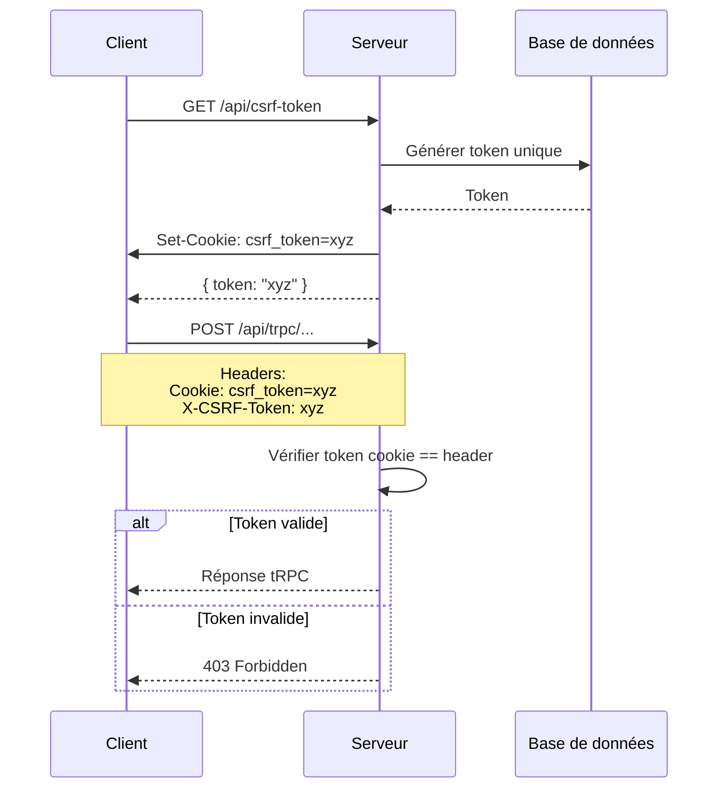
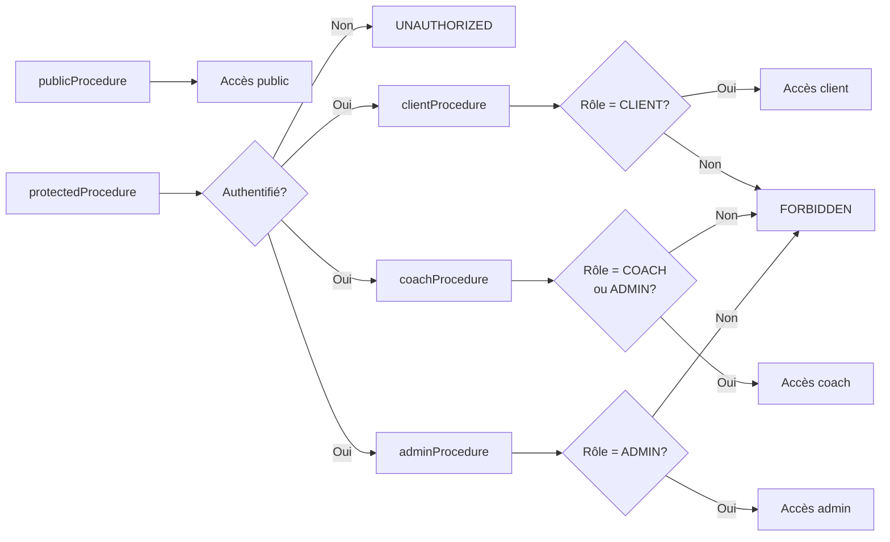
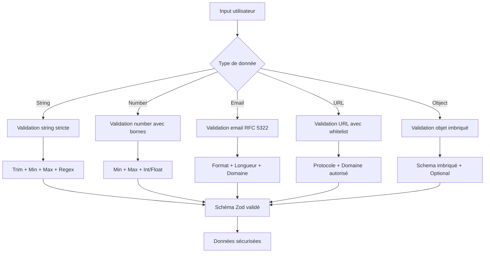
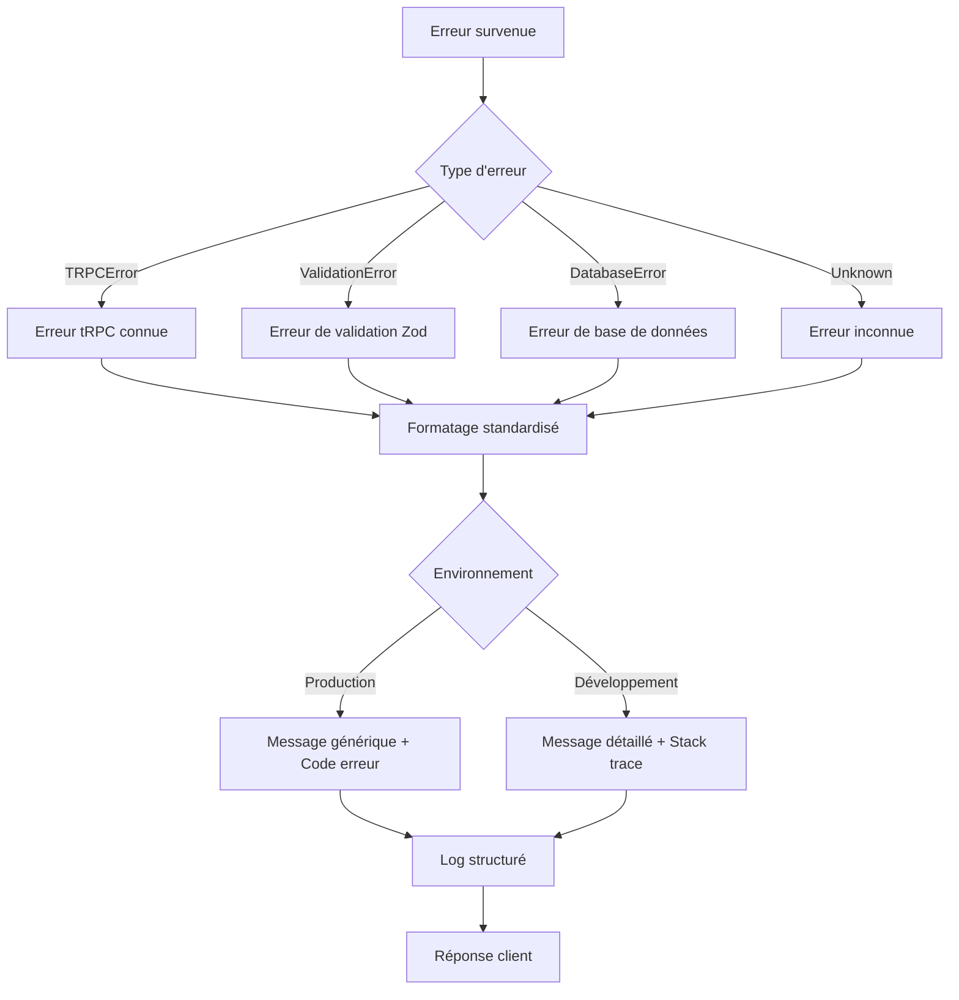
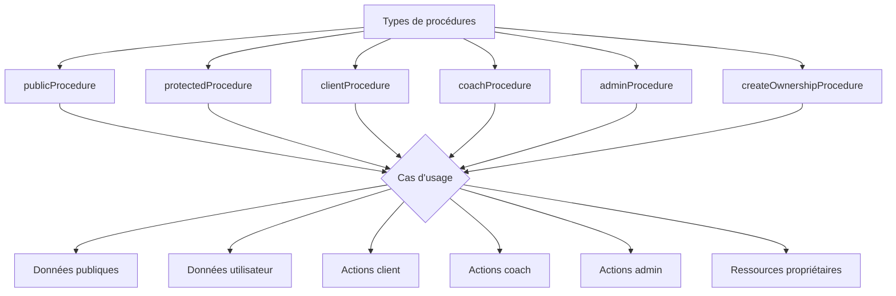

# Plan de Sécurité tRPC - Andaloussi Coaching

## Table des matières

1. [Analyse de l'architecture actuelle](#analyse-de-larchitecture-actuelle)
2. [Architecture de sécurité proposée](#architecture-de-sécurité-proposée)
3. [Protection CSRF](#protection-csrf)
4. [Middlewares RBAC](#middlewares-rbac)
5. [Validation Zod stricte](#validation-zod-stricte)
6. [Limitation Body Parser](#limitation-body-parser)
7. [Gestion des erreurs](#gestion-des-erreurs)
8. [Architecture des procédures](#architecture-des-procédures)
9. [Plan de mise en œuvre](#plan-de-mise-en-œuvre)

---

## Analyse de l'architecture actuelle

### Fichiers existants

| Fichier | Rôle | Observations |
|---------|------|--------------|
| [`server/_core/trpc.ts`](../server/_core/trpc.ts) | Moteur tRPC | Définit `publicProcedure`, `protectedProcedure`, `adminProcedure` |
| [`server/_core/context.ts`](../server/_core/context.ts) | Contexte tRPC | `ctx.user: User \| null` disponible dans toutes les procédures |
| [`server/_core/index.ts`](../server/_core/index.ts) | Configuration Express | Body parser limité à 50mb (ligne 35-36) |
| [`server/routers.ts`](../server/routers.ts) | Routers principaux | Contient des procédures avec validations Zod basiques |
| [`drizzle/schema.ts`](../drizzle/schema.ts) | Schéma DB | Rôle utilisateur: enum `["user", "admin"]` (ligne 19) |

### Points forts actuels

✅ **Authentification centralisée** : [`createContext()`](../server/_core/context.ts:11) utilise [`sdk.authenticateRequest()`](../server/_core/context.ts:17) pour extraire l'utilisateur

✅ **Middlewares de base** : [`protectedProcedure`](../server/_core/trpc.ts:28) et [`adminProcedure`](../server/_core/trpc.ts:30) existent déjà

✅ **Codes d'erreur tRPC** : Utilisation correcte de `UNAUTHORIZED`, `FORBIDDEN`, `NOT_FOUND`

✅ **Messages d'erreur centralisés** : [`UNAUTHED_ERR_MSG`](../shared/const.ts:26) et [`NOT_ADMIN_ERR_MSG`](../shared/const.ts:27) dans [`shared/const.ts`](../shared/const.ts)

### Faiblesses identifiées

❌ **Pas de protection CSRF** : Aucun middleware CSRF configuré

❌ **Validation Zod insuffisante** : Utilisation de `z.string()` sans contraintes (min/max/trim)

❌ **Body parser trop permissif** : Limite à 50mb au lieu de 10mb recommandé

❌ **Rôles limités** : Seuls `["user", "admin"]` au lieu de `["CLIENT", "COACH", "ADMIN"]`

❌ **Pas de middleware RBAC réutilisable** : Chaque router définit son propre `adminProcedure` (ex: [`workoutRouter.ts:9`](../server/workoutRouter.ts:9))

❌ **Stack traces exposées** : En développement, les erreurs tRPC peuvent exposer des informations sensibles

---

## Architecture de sécurité proposée

### Vue d'ensemble

```mermaid
graph TD
    A[Requête Client] --> B[Express Middleware]
    B --> C{Body Parser<br/>limit: 10mb}
    C --> D[CSRF Middleware<br/>Header: X-CSRF-Token}
    D --> E[tRPC Middleware<br/>createContext}
    E --> F{Middleware RBAC}
    F -->|publicProcedure| G[Procédure publique]
    F -->|protectedProcedure| H{Authentifié?}
    H -->|Non| I[UNAUTHORIZED]
    H -->|Oui| J{Rôle autorisé?}
    J -->|Non| K[FORBIDDEN]
    J -->|Oui| L[Procédure protégée]
    L --> M[Validation Zod stricte]
    M --> N[Logique métier]
    N --> O[Réponse sécurisée]
```

### Fichiers à créer/modifier

| Fichier | Action | Description |
|---------|--------|-------------|
| `server/_core/trpc.ts` | Modifier | Ajouter middlewares RBAC avancés |
| `server/_core/csrf.ts` | Créer | Middleware CSRF personnalisé |
| `server/_core/validation.ts` | Créer | Schémas Zod réutilisables |
| `server/_core/errorHandler.ts` | Créer | Gestion d'erreurs centralisée |
| `server/_core/index.ts` | Modifier | Réduire body parser à 10mb |
| `drizzle/schema.ts` | Modifier | Étendre les rôles utilisateurs |
| `shared/const.ts` | Modifier | Ajouter constantes de sécurité |

---

## Protection CSRF

### Analyse des options

| Approche | Avantages | Inconvients | Recommandation |
|----------|-----------|-------------|----------------|
| **Header personnalisé** | Simple, compatible tRPC, pas de cookies supplémentaires | Requiert configuration client | ✅ **Recommandé** |
| **Middleware csurf** | Standard, éprouvé | Dépendance externe, double cookie | ⚠️ Alternative |
| **Double Submit Cookie** | Standard OWASP | Complexité accrue | ❌ Non recommandé |

### Solution proposée : Header personnalisé

#### Pourquoi cette approche ?

1. **Compatible tRPC** : tRPC envoie déjà des headers personnalisés
2. **Simple à implémenter** : Un header `X-CSRF-Token` dans chaque requête
3. **Pas de cookies supplémentaires** : Utilise le cookie de session existant
4. **Performant** : Pas de requêtes supplémentaires

#### Architecture



### Implémentation proposée

#### 1. Créer `server/_core/csrf.ts`

```typescript
import crypto from 'crypto';
import type { Request, Response, NextFunction } from 'express';

const CSRF_COOKIE_NAME = 'csrf_token';
const CSRF_HEADER_NAME = 'X-CSRF-Token';
const CSRF_TOKEN_LENGTH = 32;

/**
 * Génère un token CSRF sécurisé
 */
export function generateCSRFToken(): string {
  return crypto.randomBytes(CSRF_TOKEN_LENGTH).toString('hex');
}

/**
 * Définit le cookie CSRF dans la réponse
 */
export function setCSRFCookie(res: Response, token: string): void {
  res.cookie(CSRF_COOKIE_NAME, token, {
    httpOnly: true,
    secure: process.env.NODE_ENV === 'production',
    sameSite: 'strict',
    maxAge: 1000 * 60 * 60 * 24, // 24 heures
    path: '/',
  });
}

/**
 * Vérifie le token CSRF dans la requête
 */
export function validateCSRF(req: Request): boolean {
  const cookieToken = req.cookies[CSRF_COOKIE_NAME];
  const headerToken = req.headers[CSRF_HEADER_NAME.toLowerCase()] as string;

  if (!cookieToken || !headerToken) {
    return false;
  }

  // Comparaison sécurisée pour éviter les attaques timing
  return crypto.timingSafeEqual(
    Buffer.from(cookieToken),
    Buffer.from(headerToken)
  );
}

/**
 * Middleware Express pour la protection CSRF
 * Ignore les requêtes GET, HEAD, OPTIONS (idempotentes)
 */
export function csrfMiddleware(req: Request, res: Response, next: NextFunction): void {
  // Ignorer les méthodes idempotentes
  if (['GET', 'HEAD', 'OPTIONS'].includes(req.method)) {
    return next();
  }

  // Ignorer les routes OAuth (callback externe)
  if (req.path.startsWith('/api/oauth')) {
    return next();
  }

  // Vérifier le token pour les mutations tRPC
  if (req.path.startsWith('/api/trpc')) {
    if (!validateCSRF(req)) {
      res.status(403).json({
        error: 'CSRF token validation failed',
        code: 'CSRF_INVALID',
      });
      return;
    }
  }

  next();
}

/**
 * Endpoint pour récupérer le token CSRF
 */
export function getCSRFTokenEndpoint(req: Request, res: Response): void {
  const token = generateCSRFToken();
  setCSRFCookie(res, token);
  res.json({ token });
}
```

#### 2. Modifier `server/_core/index.ts`

```typescript
import { csrfMiddleware, getCSRFTokenEndpoint } from './csrf';

async function startServer() {
  const app = express();
  const server = createServer(app);

  // Réduire la limite du body parser à 10mb
  app.use(express.json({ limit: "10mb" }));
  app.use(express.urlencoded({ limit: "10mb", extended: true }));

  // Endpoint CSRF (avant le middleware CSRF)
  app.get('/api/csrf-token', getCSRFTokenEndpoint);

  // Middleware CSRF (après l'endpoint, avant tRPC)
  app.use(csrfMiddleware);

  // OAuth callback (exempté du CSRF)
  registerOAuthRoutes(app);

  // tRPC API
  app.use(
    "/api/trpc",
    createExpressMiddleware({
      router: appRouter,
      createContext,
    })
  );

  // ... reste du code
}
```

#### 3. Configuration client tRPC

```typescript
// client/src/lib/trpc.ts
import { createTRPCReact } from '@trpc/react-query';
import type { AppRouter } from '../../server/routers';

export const trpc = createTRPCReact<AppRouter>();

// Dans le composant principal ou un hook d'authentification
export function setupCSRFHeaders() {
  // Récupérer le token CSRF au chargement
  fetch('/api/csrf-token')
    .then(res => res.json())
    .then(({ token }) => {
      // Stocker le token pour les requêtes futures
      localStorage.setItem('csrf_token', token);
    });
}

// Configurer les headers tRPC
export const trpcClient = trpc.createClient({
  links: [
    httpBatchLink({
      url: '/api/trpc',
      headers: () => {
        const token = localStorage.getItem('csrf_token');
        return {
          'X-CSRF-Token': token || '',
        };
      },
    }),
  ],
});
```

### Avantages de cette solution

✅ **Sécurité** : Token cryptographiquement sécurisé avec `crypto.randomBytes()`

✅ **Performance** : Comparaison `timingSafeEqual` pour éviter les attaques timing

✅ **UX** : Cookie HTTP-only + header personnalisé, compatible avec SameSite=strict

✅ **Maintenance** : Code centralisé dans un fichier dédié

✅ **Testabilité** : Fonctions pures facilement testables

---

## Middlewares RBAC

### Analyse des rôles actuels

```typescript
// drizzle/schema.ts:19
role: mysqlEnum("role", ["user", "admin"]).default("user").notNull(),
```

**Problème** : Seulement 2 rôles, pas de distinction entre coach et client.

### Rôles proposés

| Rôle | Description | Permissions |
|------|-------------|-------------|
| `CLIENT` | Utilisateur final | Voir ses programmes, sessions, progression |
| `COACH` | Coach sportif | Gérer les programmes de ses clients, voir leurs données |
| `ADMIN` | Administrateur système | Accès complet, gestion des utilisateurs |

### Architecture RBAC



### Implémentation proposée

#### 1. Modifier `drizzle/schema.ts`

```typescript
export const users = mysqlTable("users", {
  id: int("id").autoincrement().primaryKey(),
  openId: varchar("openId", { length: 64 }).notNull().unique(),
  name: text("name"),
  email: varchar("email", { length: 320 }),
  loginMethod: varchar("loginMethod", { length: 64 }),
  // MODIFICATION: Étendre les rôles
  role: mysqlEnum("role", ["CLIENT", "COACH", "ADMIN"]).default("CLIENT").notNull(),
  createdAt: timestamp("createdAt").defaultNow().notNull(),
  updatedAt: timestamp("updatedAt").defaultNow().onUpdateNow().notNull(),
  lastSignedIn: timestamp("lastSignedIn").defaultNow().notNull(),
});

export type UserRole = "CLIENT" | "COACH" | "ADMIN";
```

#### 2. Créer `server/_core/rbac.ts`

```typescript
import { TRPCError } from '@trpc/server';
import type { TrpcContext } from './context';
import type { UserRole } from '../../drizzle/schema';
import { NOT_AUTHENTICATED_MSG, FORBIDDEN_ROLE_MSG } from '@shared/const';

/**
 * Type pour les rôles autorisés
 */
export type AllowedRoles = UserRole | UserRole[];

/**
 * Middleware tRPC pour vérifier l'authentification
 */
export const requireAuth = (allowedRoles?: AllowedRoles) => 
  async ({ ctx, next }: { ctx: TrpcContext; next: any }) => {
    // Vérifier si l'utilisateur est authentifié
    if (!ctx.user) {
      throw new TRPCError({
        code: 'UNAUTHORIZED',
        message: NOT_AUTHENTICATED_MSG,
      });
    }

    // Si aucun rôle spécifié, autoriser tous les utilisateurs authentifiés
    if (!allowedRoles) {
      return next({
        ctx: {
          ...ctx,
          user: ctx.user,
        },
      });
    }

    // Normaliser les rôles autorisés en tableau
    const roles = Array.isArray(allowedRoles) ? allowedRoles : [allowedRoles];

    // Vérifier si le rôle de l'utilisateur est autorisé
    if (!roles.includes(ctx.user.role)) {
      throw new TRPCError({
        code: 'FORBIDDEN',
        message: FORBIDDEN_ROLE_MSG(ctx.user.role, roles),
      });
    }

    return next({
      ctx: {
        ...ctx,
        user: ctx.user,
      },
    });
  };

/**
 * Middleware pour vérifier que l'utilisateur est un client
 */
export const requireClient = requireAuth('CLIENT');

/**
 * Middleware pour vérifier que l'utilisateur est un coach ou admin
 */
export const requireCoach = requireAuth(['COACH', 'ADMIN']);

/**
 * Middleware pour vérifier que l'utilisateur est un admin
 */
export const requireAdmin = requireAuth('ADMIN');

/**
 * Middleware pour vérifier que l'utilisateur est le propriétaire de la ressource
 * ou a un rôle autorisé
 */
export const requireOwnershipOrRole = (
  getResourceOwnerId: (input: any) => number | Promise<number>,
  allowedRoles: AllowedRoles = ['ADMIN']
) => 
  async ({ ctx, input, next }: { ctx: TrpcContext; input: any; next: any }) => {
    if (!ctx.user) {
      throw new TRPCError({
        code: 'UNAUTHORIZED',
        message: NOT_AUTHENTICATED_MSG,
      });
    }

    // Vérifier si l'utilisateur a un rôle autorisé
    const roles = Array.isArray(allowedRoles) ? allowedRoles : [allowedRoles];
    if (roles.includes(ctx.user.role)) {
      return next({ ctx });
    }

    // Vérifier la propriété de la ressource
    const resourceOwnerId = await getResourceOwnerId(input);
    if (ctx.user.id !== resourceOwnerId) {
      throw new TRPCError({
        code: 'FORBIDDEN',
        message: 'You do not have permission to access this resource',
      });
    }

    return next({ ctx });
  };
```

#### 3. Modifier `server/_core/trpc.ts`

```typescript
import { initTRPC, TRPCError } from "@trpc/server";
import superjson from "superjson";
import type { TrpcContext } from "./context";
import { 
  requireAuth, 
  requireClient, 
  requireCoach, 
  requireAdmin,
  requireOwnershipOrRole
} from "./rbac";

const t = initTRPC.context<TrpcContext>().create({
  transformer: superjson,
});

export const router = t.router;
export const publicProcedure = t.procedure;

/**
 * Procédure protégée : nécessite une authentification
 */
export const protectedProcedure = t.procedure.use(requireAuth());

/**
 * Procédure client : réservée aux clients
 */
export const clientProcedure = t.procedure.use(requireClient);

/**
 * Procédure coach : réservée aux coaches et admins
 */
export const coachProcedure = t.procedure.use(requireCoach);

/**
 * Procédure admin : réservée aux admins
 */
export const adminProcedure = t.procedure.use(requireAdmin);

/**
 * Créateur de procédure avec vérification de propriété
 * @param getResourceOwnerId Fonction pour extraire l'ID du propriétaire de l'input
 * @param allowedRoles Rôles autorisés à accéder sans être propriétaire
 */
export function createOwnershipProcedure(
  getResourceOwnerId: (input: any) => number | Promise<number>,
  allowedRoles: AllowedRoles = ['ADMIN']
) {
  return t.procedure.use(requireOwnershipOrRole(getResourceOwnerId, allowedRoles));
}
```

#### 4. Ajouter des constantes dans `shared/const.ts`

```typescript
export const NOT_AUTHENTICATED_MSG = 'Authentication required (10001)';

/**
 * Message d'erreur pour rôle non autorisé
 * @param userRole Rôle de l'utilisateur
 * @param allowedRoles Rôles autorisés
 */
export function FORBIDDEN_ROLE_MSG(userRole: string, allowedRoles: string[]): string {
  return `Role '${userRole}' not authorized. Required: ${allowedRoles.join(' or ')} (10002)`;
}

export const OWNERSHIP_REQUIRED_MSG = 'You do not have permission to access this resource (10003)';
```

### Exemples d'utilisation

#### Procédure publique

```typescript
export const exampleRouter = router({
  // Accès à tous
  getPublicData: publicProcedure
    .query(async () => {
      return { message: 'Public data' };
    }),
});
```

#### Procédure protégée (authentifié)

```typescript
export const exampleRouter = router({
  // Accès à tous les utilisateurs authentifiés
  getMyProfile: protectedProcedure
    .query(async ({ ctx }) => {
      return ctx.user;
    }),
});
```

#### Procédure client

```typescript
export const workoutRouter = router({
  // Seuls les clients peuvent marquer leurs sessions comme complétées
  completeSession: clientProcedure
    .input(z.object({
      sessionId: z.number(),
      duration: z.number(),
    }))
    .mutation(async ({ ctx, input }) => {
      // ctx.user.role est garanti être 'CLIENT'
      // Logique métier...
    }),
});
```

#### Procédure coach

```typescript
export const workoutRouter = router({
  // Coaches et admins peuvent créer des sessions
  createSession: coachProcedure
    .input(z.object({
      userId: z.number(),
      title: z.string(),
      // ...
    }))
    .mutation(async ({ ctx, input }) => {
      // ctx.user.role est garanti être 'COACH' ou 'ADMIN'
      // Logique métier...
    }),
});
```

#### Procédure admin

```typescript
export const adminRouter = router({
  // Seuls les admins peuvent gérer les utilisateurs
  getAllUsers: adminProcedure
    .query(async () => {
      // ctx.user.role est garanti être 'ADMIN'
      // Logique métier...
    }),
});
```

#### Procédure avec vérification de propriété

```typescript
export const workoutRouter = router({
  // L'utilisateur peut voir sa session, ou un admin peut voir n'importe quelle session
  getSession: createOwnershipProcedure(
    async (input) => {
      const db = await getDb();
      const session = await db
        .select()
        .from(workoutSessions)
        .where(eq(workoutSessions.id, input.sessionId))
        .limit(1);
      return session[0]?.userId;
    },
    ['ADMIN']
  )
  .input(z.object({ sessionId: z.number() }))
  .query(async ({ input }) => {
    // Logique métier...
  }),
});
```

### Avantages de cette architecture

✅ **Type-safe** : Types TypeScript stricts pour les rôles

✅ **Réutilisable** : Middlewares réutilisables dans tous les routers

✅ **Flexible** : Supporte les rôles simples et multiples

✅ **Extensible** : Facile d'ajouter de nouveaux rôles

✅ **Clair** : Syntaxe explicite (`clientProcedure`, `coachProcedure`, `adminProcedure`)

✅ **Testable** : Middlewares isolés et testables

---

## Validation Zod stricte

### Analyse des validations actuelles

```typescript
// Exemple dans server/routers.ts:86
.input(z.object({ id: z.number() }))

// Exemple dans server/workoutRouter.ts:20
.input(z.object({
  sessionId: z.number(),
  newDate: z.date(),
}))

// Exemple dans server/workoutRouter.ts:108
.input(z.object({
  userId: z.number(),
  title: z.string(),
  description: z.string().optional(),
  // ...
}))
```

**Problèmes identifiés** :

❌ `z.string()` sans contraintes de longueur

❌ Pas de trim() automatique

❌ Pas de validation de format (email, URL, etc.)

❌ Pas de sanitization des entrées

❌ Objets JSON complexes sans validation stricte

### Architecture de validation proposée



### Implémentation proposée

#### 1. Créer `server/_core/validation.ts`

```typescript
import { z } from 'zod';

/**
 * ============================================
 * VALIDATIONS STRING STRICTES
 * ============================================
 */

/**
 * Schéma pour les chaînes de caractères avec trim et contraintes
 */
export const strictString = (options?: {
  min?: number;
  max?: number;
  pattern?: RegExp;
}) => 
  z.string()
    .trim()
    .min(options?.min ?? 1, `Minimum ${options?.min ?? 1} caractères requis`)
    .max(options?.max ?? 1000, `Maximum ${options?.max ?? 1000} caractères autorisés`)
    .refine(
      (val) => !options?.pattern || options.pattern.test(val),
      'Format invalide'
    );

/**
 * Schéma pour les noms (lettres, espaces, tirets, apostrophes)
 */
export const nameSchema = strictString({
  min: 2,
  max: 100,
  pattern: /^[a-zA-ZàâäéèêëïîôùûüÿçÀÂÄÉÈÊËÏÎÔÙÛÜŸÇ\s'-]+$/,
});

/**
 * Schéma pour les emails (RFC 5322 simplifié)
 */
export const emailSchema = z.string()
  .trim()
  .toLowerCase()
  .min(5, 'Email trop court')
  .max(320, 'Email trop long')
  .email('Format email invalide')
  .refine(
    (email) => {
      // Validation supplémentaire : pas d'espaces, caractères spéciaux limités
      const localPart = email.split('@')[0];
      return localPart.length >= 1 && localPart.length <= 64;
    },
    'Partie locale de l\'email invalide'
  );

/**
 * Schéma pour les URLs (avec whitelist de domaines)
 */
export const urlSchema = (options?: {
  allowedProtocols?: string[];
  allowedDomains?: string[];
}) =>
  z.string()
    .trim()
    .url('URL invalide')
    .refine(
      (url) => {
        const parsed = new URL(url);
        
        // Vérifier le protocole
        if (options?.allowedProtocols) {
          if (!options.allowedProtocols.includes(parsed.protocol.replace(':', ''))) {
            return false;
          }
        }
        
        // Vérifier le domaine
        if (options?.allowedDomains) {
          return options.allowedDomains.some(domain => 
            parsed.hostname === domain || parsed.hostname.endsWith(`.${domain}`)
          );
        }
        
        return true;
      },
      'URL non autorisée'
    );

/**
 * Schéma pour les descriptions de texte long
 */
export const descriptionSchema = strictString({
  min: 0,
  max: 5000,
});

/**
 * Schéma pour les notes/courts messages
 */
export const noteSchema = strictString({
  min: 0,
  max: 1000,
});

/**
 * ============================================
 * VALIDATIONS NUMBER STRICTES
 * ============================================
 */

/**
 * Schéma pour les nombres entiers positifs
 */
export const positiveIntSchema = (options?: {
  min?: number;
  max?: number;
}) =>
  z.number()
    .int('Doit être un entier')
    .min(options?.min ?? 0, `Minimum ${options?.min ?? 0}`)
    .max(options?.max ?? Number.MAX_SAFE_INTEGER, `Maximum ${options?.max}`);

/**
 * Schéma pour les nombres décimaux positifs
 */
export const positiveFloatSchema = (options?: {
  min?: number;
  max?: number;
  precision?: number;
}) =>
  z.number()
    .min(options?.min ?? 0, `Minimum ${options?.min ?? 0}`)
    .max(options?.max ?? Number.MAX_SAFE_INTEGER, `Maximum ${options?.max}`)
    .refine(
      (val) => {
        if (options?.precision === undefined) return true;
        const decimals = val.toString().split('.')[1]?.length || 0;
        return decimals <= options.precision;
      },
      `Maximum ${options?.precision} décimales`
    );

/**
 * Schéma pour les pourcentages (0-100)
 */
export const percentageSchema = z.number()
  .min(0, 'Minimum 0%')
  .max(100, 'Maximum 100%');

/**
 * Schéma pour les notes (1-5 étoiles)
 */
export const ratingSchema = z.number()
  .int('Doit être un entier')
  .min(1, 'Minimum 1 étoile')
  .max(5, 'Maximum 5 étoiles');

/**
 * ============================================
 * VALIDATIONS DATE/TIME
 * ============================================
 */

/**
 * Schéma pour les dates futures
 */
export const futureDateSchema = z.date()
  .refine(
    (date) => date > new Date(),
    'La date doit être dans le futur'
  );

/**
 * Schéma pour les dates passées
 */
export const pastDateSchema = z.date()
  .refine(
    (date) => date < new Date(),
    'La date doit être dans le passé'
  );

/**
 * ============================================
 * VALIDATIONS D'OBJETS COMPLEXES
 * ============================================
 */

/**
 * Schéma pour les coordonnées géographiques
 */
export const coordinatesSchema = z.object({
  latitude: positiveFloatSchema({ min: -90, max: 90, precision: 6 }),
  longitude: positiveFloatSchema({ min: -180, max: 180, precision: 6 }),
});

/**
 * Schéma pour les métadonnées JSON
 */
export const metadataSchema = z.object({
  key: strictString({ max: 100 }),
  value: z.union([
    z.string(),
    z.number(),
    z.boolean(),
    z.array(z.any()),
    z.record(z.any()),
  ]),
}).array();

/**
 * Schéma pour les filtres de recherche
 */
export const searchFiltersSchema = z.object({
  query: strictString({ min: 0, max: 200 }).optional(),
  page: positiveIntSchema({ min: 1, max: 1000 }).default(1),
  limit: positiveIntSchema({ min: 1, max: 100 }).default(20),
  sortBy: strictString({ max: 50 }).optional(),
  sortOrder: z.enum(['asc', 'desc']).default('asc'),
});

/**
 * ============================================
 * SCHÉMAS SPÉCIFIQUES AU COACHING
 * ============================================
 */

/**
 * Schéma pour les exercices
 */
export const exerciseSchema = z.object({
  name: strictString({ min: 2, max: 100 }),
  description: descriptionSchema.optional(),
  category: z.enum(['cardio', 'strength', 'flexibility', 'hiit', 'endurance', 'recovery']),
  difficulty: z.enum(['beginner', 'intermediate', 'advanced', 'expert']),
  videoUrl: urlSchema({ allowedProtocols: ['https'], allowedDomains: ['youtube.com', 'youtu.be', 'vimeo.com'] }).optional(),
  duration: positiveIntSchema({ min: 1, max: 7200 }).optional(), // max 2 heures
  equipment: z.array(strictString({ max: 50 })).optional(),
  muscleGroups: z.array(strictString({ max: 50 })).optional(),
  instructions: descriptionSchema.optional(),
  tips: noteSchema.optional(),
});

/**
 * Schéma pour les sessions d'entraînement
 */
export const workoutSessionSchema = z.object({
  userId: positiveIntSchema(),
  programId: positiveIntSchema().optional(),
  title: strictString({ min: 2, max: 200 }),
  description: descriptionSchema.optional(),
  type: z.enum(['cardio', 'strength', 'flexibility', 'hiit', 'endurance', 'recovery']),
  scheduledDate: z.date(),
  duration: positiveIntSchema({ min: 1, max: 480 }).optional(), // max 8 heures
  difficulty: z.enum(['easy', 'medium', 'hard', 'extreme']).optional(),
  instructions: descriptionSchema.optional(),
  videoUrl: urlSchema({ allowedProtocols: ['https'], allowedDomains: ['youtube.com', 'youtu.be', 'vimeo.com'] }).optional(),
});

/**
 * Schéma pour les programmes
 */
export const programSchema = z.object({
  name: strictString({ min: 2, max: 200 }),
  description: descriptionSchema.optional(),
  category: z.enum(['transformation', 'performance', 'inclusive']),
  duration: positiveIntSchema({ min: 1, max: 365 }).optional(), // max 1 an
});

/**
 * Schéma pour les messages
 */
export const messageSchema = z.object({
  conversationId: positiveIntSchema(),
  content: strictString({ min: 1, max: 10000 }),
  type: z.enum(['text', 'image', 'video', 'file']).default('text'),
  fileUrl: urlSchema({ allowedProtocols: ['https'] }).optional(),
});

/**
 * Schéma pour les métriques de progression
 */
export const progressMetricSchema = z.object({
  clientProgramId: positiveIntSchema(),
  metricType: z.enum(['weight', 'bodyFat', 'performance', 'energy', 'custom']),
  value: positiveFloatSchema({ min: 0, max: 1000, precision: 2 }),
  unit: strictString({ max: 20 }).optional(),
  notes: noteSchema.optional(),
  recordedAt: z.date(),
});

/**
 * Schéma pour les objectifs de progression
 */
export const progressGoalSchema = z.object({
  clientProgramId: positiveIntSchema(),
  goalType: z.enum(['weight', 'bodyFat', 'performance', 'custom']),
  targetValue: positiveFloatSchema({ min: 0, max: 1000, precision: 2 }),
  unit: strictString({ max: 20 }).optional(),
  startValue: positiveFloatSchema({ min: 0, max: 1000, precision: 2 }).optional(),
  description: descriptionSchema.optional(),
});

/**
 * ============================================
 * UTILITAIRES DE VALIDATION
 * ============================================
 */

/**
 * Crée un schéma pour les IDs de ressources
 */
export const resourceIdSchema = positiveIntSchema({ min: 1 });

/**
 * Crée un schéma pour les listes paginées
 */
export const paginatedListSchema = <T extends z.ZodTypeAny>(itemSchema: T) =>
  z.object({
    items: z.array(itemSchema),
    total: positiveIntSchema(),
    page: positiveIntSchema({ min: 1 }),
    limit: positiveIntSchema({ min: 1, max: 100 }),
  });

/**
 * Crée un schéma pour les réponses API standardisées
 */
export const apiResponseSchema = <T extends z.ZodTypeAny>(dataSchema: T) =>
  z.object({
    success: z.boolean(),
    data: dataSchema.optional(),
    error: z.object({
      code: z.string(),
      message: z.string(),
    }).optional(),
  });
```

#### 2. Exemples d'utilisation dans les routers

##### Avant (validation insuffisante)

```typescript
// server/workoutRouter.ts:108
.input(z.object({
  userId: z.number(),
  title: z.string(),
  description: z.string().optional(),
  type: z.enum(["cardio", "strength", "flexibility", "hiit", "endurance", "recovery"]),
  scheduledDate: z.date(),
  duration: z.number().optional(),
  difficulty: z.enum(["easy", "medium", "hard", "extreme"]).optional(),
  instructions: z.string().optional(),
  videoUrl: z.string().optional(),
}))
```

##### Après (validation stricte)

```typescript
import { workoutSessionSchema, positiveIntSchema } from './_core/validation';

export const workoutRouter = router({
  createSession: coachProcedure
    .input(workoutSessionSchema)
    .mutation(async ({ input }) => {
      // input est maintenant strictement validé et typé
      const db = await getDb();
      if (!db) throw new TRPCError({ code: 'INTERNAL_SERVER_ERROR', message: 'Database not available' });

      const newSession: InsertWorkoutSession = {
        ...input,
        isCompleted: 0,
      };

      const result = await db.insert(workoutSessions).values(newSession);
      return { id: Number((result as any).insertId), success: true };
    }),

  // Pour les opérations simples avec un ID
  deleteSession: adminProcedure
    .input(z.object({ sessionId: resourceIdSchema }))
    .mutation(async ({ input }) => {
      const db = await getDb();
      if (!db) throw new TRPCError({ code: 'INTERNAL_SERVER_ERROR', message: 'Database not available' });

      await db.delete(workoutSessions).where(eq(workoutSessions.id, input.sessionId));
      return { success: true };
    }),

  // Pour les listes paginées
  getUserSessions: protectedProcedure
    .input(searchFiltersSchema.extend({
      userId: positiveIntSchema().optional(),
      startDate: z.date().optional(),
      endDate: z.date().optional(),
    }))
    .query(async ({ ctx, input }) => {
      // Logique métier...
    }),
});
```

##### Exemple avec validation personnalisée

```typescript
import { strictString, emailSchema, futureDateSchema } from './_core/validation';

export const userRouter = router({
  updateProfile: protectedProcedure
    .input(z.object({
      name: nameSchema.optional(),
      email: emailSchema.optional(),
      bio: descriptionSchema.optional(),
    }))
    .mutation(async ({ ctx, input }) => {
      // Logique métier...
    }),

  // Validation complexe avec dépendances
  scheduleSession: coachProcedure
    .input(z.object({
      userId: positiveIntSchema(),
      title: strictString({ min: 2, max: 200 }),
      scheduledDate: z.date(),
      duration: positiveIntSchema({ min: 15, max: 480 }),
    }))
    .refine(
      (input) => {
        // La date doit être dans le futur
        const minDate = new Date();
        minDate.setHours(minDate.getHours() + 1); // Au moins 1 heure à l'avance
        return input.scheduledDate > minDate;
      },
      { path: ['scheduledDate'], message: 'La session doit être programmée au moins 1 heure à l\'avance' }
    )
    .refine(
      (input) => {
        // Vérifier que la durée est un multiple de 15 minutes
        return input.duration % 15 === 0;
      },
      { path: ['duration'], message: 'La durée doit être un multiple de 15 minutes' }
    )
    .mutation(async ({ input }) => {
      // Logique métier...
    }),
});
```

### Avantages de cette architecture

✅ **Anti-injection** : Trim automatique, validation stricte des formats

✅ **Type-safe** : TypeScript déduit les types depuis les schémas Zod

✅ **Réutilisable** : Schémas réutilisables dans tous les routers

✅ **Maintenable** : Centralisé dans un fichier dédié

✅ **Extensible** : Facile d'ajouter de nouveaux schémas

✅ **Testable** : Schémas isolés et testables

✅ **Documentation** : Les messages d'erreur sont explicites

---

## Limitation Body Parser

### Analyse actuelle

```typescript
// server/_core/index.ts:35-36
app.use(express.json({ limit: "50mb" }));
app.use(express.urlencoded({ limit: "50mb", extended: true }));
```

**Problème** : Limite de 50mb est trop permissive et expose à des attaques DoS.

### Recommandations

| Type de contenu | Limite recommandée | Justification |
|-----------------|-------------------|---------------|
| JSON | 10mb | Suffisant pour la plupart des payloads |
| URL-encoded | 10mb | Suffisant pour les formulaires |
| Multipart (fichiers) | 50mb | Nécessaire pour les vidéos/images |

### Implémentation proposée

#### Modifier `server/_core/index.ts`

```typescript
import express from "express";
import { createServer } from "http";
import { createExpressMiddleware } from "@trpc/server/adapters/express";
import { registerOAuthRoutes } from "./oauth";
import { appRouter } from "../routers";
import { createContext } from "./context";
import { serveStatic, setupVite } from "./vite";
import { initializeSocket } from "../socket";

async function startServer() {
  const app = express();
  const server = createServer(app);

  // MODIFICATION: Réduire la limite du body parser à 10mb
  // Cela protège contre les attaques DoS par surcharge de payload
  app.use(express.json({ 
    limit: "10mb",
    strict: true, // Rejette les objets JSON invalides
  }));
  
  app.use(express.urlencoded({ 
    limit: "10mb", 
    extended: true,
    parameterLimit: 100, // Limite le nombre de paramètres
  }));

  // Pour les uploads de fichiers (vidéos, images), utiliser un middleware séparé
  // avec une limite plus élevée, mais uniquement sur les routes spécifiques
  // Exemple:
  // app.use('/api/upload', multer({ limits: { fileSize: 50 * 1024 * 1024 } }).single('file'));

  // OAuth callback sous /api/oauth/callback
  registerOAuthRoutes(app);

  // tRPC API
  app.use(
    "/api/trpc",
    createExpressMiddleware({
      router: appRouter,
      createContext,
    })
  );

  // ... reste du code
}
```

### Justification technique

1. **Protection DoS** : Limite l'impact des attaques par surcharge de payload

2. **Performance** : Réduit la consommation de mémoire et CPU

3. **Suffisant** : 10mb est largement suffisant pour:
   - JSON complexes (objets imbriqués, listes)
   - Formulaires avec de nombreux champs
   - Données textuelles longues (descriptions, notes)

4. **Séparation des concerns** : Les fichiers lourds (vidéos, images) doivent être uploadés via un endpoint dédié avec S3/R2, pas via tRPC

### Pourquoi pas 1mb ou 100mb ?

| Limite | Avantages | Inconvénients |
|--------|-----------|---------------|
| 1mb | Très sécurisé | Trop restrictif pour certains cas d'usage |
| 10mb | ✅ Bon équilibre sécurité/flexibilité | - |
| 50mb | Très flexible | ❌ Expose aux attaques DoS |

### Monitoring recommandé

```typescript
// Ajouter un middleware de monitoring pour les payloads volumineux
app.use((req, res, next) => {
  const contentLength = parseInt(req.headers['content-length'] || '0', 10);
  const contentLengthMB = contentLength / (1024 * 1024);
  
  // Alerter si un payload dépasse 5mb
  if (contentLengthMB > 5) {
    console.warn(`[SECURITY] Large payload detected: ${contentLengthMB.toFixed(2)}MB on ${req.path}`);
  }
  
  next();
});
```

---

## Gestion des erreurs

### Analyse actuelle

```typescript
// server/_core/trpc.ts:17
throw new TRPCError({ code: "UNAUTHORIZED", message: UNAUTHED_ERR_MSG });

// server/_core/trpc.ts:35
throw new TRPCError({ code: "FORBIDDEN", message: NOT_ADMIN_ERR_MSG });
```

**Points forts** : Utilisation correcte des codes d'erreur tRPC

**Faiblesses** : Pas de gestion centralisée, stack traces exposées en développement

### Architecture de gestion des erreurs proposée



### Implémentation proposée

#### 1. Créer `server/_core/errorHandler.ts`

```typescript
import { TRPCError } from '@trpc/server';
import { ZodError } from 'zod';

/**
 * Codes d'erreur personnalisés
 */
export enum ErrorCode {
  // Erreurs d'authentification
  UNAUTHORIZED = 'UNAUTHORIZED',
  FORBIDDEN = 'FORBIDDEN',
  INVALID_CREDENTIALS = 'INVALID_CREDENTIALS',
  TOKEN_EXPIRED = 'TOKEN_EXPIRED',
  
  // Erreurs de validation
  VALIDATION_ERROR = 'VALIDATION_ERROR',
  INVALID_INPUT = 'INVALID_INPUT',
  
  // Erreurs de ressources
  NOT_FOUND = 'NOT_FOUND',
  ALREADY_EXISTS = 'ALREADY_EXISTS',
  CONFLICT = 'CONFLICT',
  
  // Erreurs de serveur
  INTERNAL_SERVER_ERROR = 'INTERNAL_SERVER_ERROR',
  DATABASE_ERROR = 'DATABASE_ERROR',
  EXTERNAL_SERVICE_ERROR = 'EXTERNAL_SERVICE_ERROR',
  
  // Erreurs de sécurité
  CSRF_INVALID = 'CSRF_INVALID',
  RATE_LIMIT_EXCEEDED = 'RATE_LIMIT_EXCEEDED',
}

/**
 * Messages d'erreur par défaut
 */
const DEFAULT_ERROR_MESSAGES: Record<ErrorCode, string> = {
  [ErrorCode.UNAUTHORIZED]: 'Authentication required',
  [ErrorCode.FORBIDDEN]: 'You do not have permission to perform this action',
  [ErrorCode.INVALID_CREDENTIALS]: 'Invalid email or password',
  [ErrorCode.TOKEN_EXPIRED]: 'Your session has expired. Please login again',
  [ErrorCode.VALIDATION_ERROR]: 'Invalid input data',
  [ErrorCode.INVALID_INPUT]: 'Invalid input format',
  [ErrorCode.NOT_FOUND]: 'Resource not found',
  [ErrorCode.ALREADY_EXISTS]: 'Resource already exists',
  [ErrorCode.CONFLICT]: 'Resource conflict',
  [ErrorCode.INTERNAL_SERVER_ERROR]: 'An unexpected error occurred',
  [ErrorCode.DATABASE_ERROR]: 'Database operation failed',
  [ErrorCode.EXTERNAL_SERVICE_ERROR]: 'External service unavailable',
  [ErrorCode.CSRF_INVALID]: 'CSRF token validation failed',
  [ErrorCode.RATE_LIMIT_EXCEEDED]: 'Too many requests. Please try again later',
};

/**
 * Classe d'erreur personnalisée
 */
export class AppError extends Error {
  constructor(
    public code: ErrorCode,
    message?: string,
    public statusCode: number = 500,
    public details?: any
  ) {
    super(message || DEFAULT_ERROR_MESSAGES[code]);
    this.name = 'AppError';
  }
}

/**
 * Crée une erreur tRPC standardisée
 */
export function createTRPCError(
  code: ErrorCode,
  message?: string,
  details?: any
): TRPCError {
  const statusCode = getStatusCodeForErrorCode(code);
  const errorMessage = message || DEFAULT_ERROR_MESSAGES[code];

  return new TRPCError({
    code: mapErrorCodeToTRPCCode(code),
    message: errorMessage,
    cause: details,
  });
}

/**
 * Mappe les codes d'erreur personnalisés vers les codes tRPC
 */
function mapErrorCodeToTRPCCode(code: ErrorCode): any {
  switch (code) {
    case ErrorCode.UNAUTHORIZED:
    case ErrorCode.INVALID_CREDENTIALS:
    case ErrorCode.TOKEN_EXPIRED:
      return 'UNAUTHORIZED';
    
    case ErrorCode.FORBIDDEN:
    case ErrorCode.CSRF_INVALID:
      return 'FORBIDDEN';
    
    case ErrorCode.NOT_FOUND:
      return 'NOT_FOUND';
    
    case ErrorCode.VALIDATION_ERROR:
    case ErrorCode.INVALID_INPUT:
      return 'BAD_REQUEST';
    
    case ErrorCode.ALREADY_EXISTS:
    case ErrorCode.CONFLICT:
      return 'CONFLICT';
    
    default:
      return 'INTERNAL_SERVER_ERROR';
  }
}

/**
 * Retourne le code HTTP pour un code d'erreur
 */
function getStatusCodeForErrorCode(code: ErrorCode): number {
  switch (code) {
    case ErrorCode.UNAUTHORIZED:
    case ErrorCode.INVALID_CREDENTIALS:
    case ErrorCode.TOKEN_EXPIRED:
      return 401;
    
    case ErrorCode.FORBIDDEN:
    case ErrorCode.CSRF_INVALID:
      return 403;
    
    case ErrorCode.NOT_FOUND:
      return 404;
    
    case ErrorCode.VALIDATION_ERROR:
    case ErrorCode.INVALID_INPUT:
      return 400;
    
    case ErrorCode.ALREADY_EXISTS:
    case ErrorCode.CONFLICT:
      return 409;
    
    case ErrorCode.RATE_LIMIT_EXCEEDED:
      return 429;
    
    default:
      return 500;
  }
}

/**
 * Formate une erreur pour la réponse client
 */
export function formatError(error: unknown, isDevelopment: boolean = false) {
  // Erreur tRPC
  if (error instanceof TRPCError) {
    return {
      code: error.code,
      message: error.message,
      ...(isDevelopment && { cause: error.cause }),
    };
  }

  // Erreur de validation Zod
  if (error instanceof ZodError) {
    return {
      code: 'BAD_REQUEST',
      message: 'Validation error',
      details: error.errors,
    };
  }

  // Erreur personnalisée
  if (error instanceof AppError) {
    return {
      code: error.code,
      message: error.message,
      ...(isDevelopment && { details: error.details }),
    };
  }

  // Erreur inconnue
  console.error('[ERROR] Unhandled error:', error);
  
  return {
    code: 'INTERNAL_SERVER_ERROR',
    message: isDevelopment ? String(error) : DEFAULT_ERROR_MESSAGES[ErrorCode.INTERNAL_SERVER_ERROR],
    ...(isDevelopment && { stack: (error as Error).stack }),
  };
}

/**
 * Logger structuré pour les erreurs
 */
export function logError(error: unknown, context?: any) {
  const timestamp = new Date().toISOString();
  const isDevelopment = process.env.NODE_ENV === 'development';
  
  const errorInfo = {
    timestamp,
    level: 'ERROR',
    ...(context && { context }),
    error: formatError(error, isDevelopment),
  };

  // En production, envoyer vers un service de monitoring (Sentry, Datadog, etc.)
  if (!isDevelopment) {
    // Exemple: Sentry.captureException(error, { extra: context });
    console.error(JSON.stringify(errorInfo));
  } else {
    console.error('[ERROR]', errorInfo);
  }
}

/**
 * Middleware tRPC pour la gestion des erreurs
 */
export function errorMiddleware() {
  return async ({ next }: { next: any }) => {
    try {
      return await next();
    } catch (error) {
      logError(error);
      throw error; // Laisser tRPC gérer la réponse
    }
  };
}

/**
 * Helpers pour créer des erreurs courantes
 */
export const Errors = {
  unauthorized: (message?: string) => createTRPCError(ErrorCode.UNAUTHORIZED, message),
  forbidden: (message?: string) => createTRPCError(ErrorCode.FORBIDDEN, message),
  notFound: (resource?: string) => 
    createTRPCError(ErrorCode.NOT_FOUND, resource ? `${resource} not found` : undefined),
  validation: (details?: any) => createTRPCError(ErrorCode.VALIDATION_ERROR, undefined, details),
  conflict: (message?: string) => createTRPCError(ErrorCode.CONFLICT, message),
  database: (message?: string) => createTRPCError(ErrorCode.DATABASE_ERROR, message),
  csrf: () => createTRPCError(ErrorCode.CSRF_INVALID),
};
```

#### 2. Modifier `server/_core/trpc.ts`

```typescript
import { initTRPC, TRPCError } from "@trpc/server";
import superjson from "superjson";
import type { TrpcContext } from "./context";
import { errorMiddleware } from "./errorHandler";

const t = initTRPC.context<TrpcContext>().create({
  transformer: superjson,
  // Ajouter le middleware de gestion des erreurs globalement
  middlewareStack: [errorMiddleware()],
});

export const router = t.router;
export const publicProcedure = t.procedure;

// ... reste du code
```

#### 3. Utilisation dans les routers

```typescript
import { Errors } from './_core/errorHandler';

export const workoutRouter = router({
  getSession: protectedProcedure
    .input(z.object({ sessionId: resourceIdSchema }))
    .query(async ({ input }) => {
      const db = await getDb();
      if (!db) {
        throw Errors.database('Database connection failed');
      }

      const session = await db
        .select()
        .from(workoutSessions)
        .where(eq(workoutSessions.id, input.sessionId))
        .limit(1);

      if (session.length === 0) {
        throw Errors.notFound('Workout session');
      }

      return session[0];
    }),
});
```

### Avantages de cette architecture

✅ **Centralisée** : Toute la logique de gestion des erreurs au même endroit

✅ **Type-safe** : Codes d'erreur typés avec TypeScript

✅ **Sécurisée** : Pas de stack traces en production

✅ **Maintenable** : Facile d'ajouter de nouveaux types d'erreurs

✅ **Observable** : Logs structurés pour le monitoring

✅ **Développement friendly** : Stack traces et détails en développement

---

## Architecture des procédures

### Vue d'ensemble des procédures



### Mapping procédure → cas d'usage

| Procédure | Cas d'usage | Exemples |
|-----------|-------------|----------|
| `publicProcedure` | Données publiques | Liste des programmes, exercices, page d'accueil |
| `protectedProcedure` | Données utilisateur authentifié | Profil utilisateur, préférences |
| `clientProcedure` | Actions réservées aux clients | Marquer une session comme complétée, voir sa progression |
| `coachProcedure` | Actions réservées aux coaches/admins | Créer des programmes, voir les données des clients |
| `adminProcedure` | Actions réservées aux admins | Gestion des utilisateurs, configuration système |
| `createOwnershipProcedure()` | Accès conditionnel | Voir/modifier ses propres ressources ou celles des autres (admin) |

### Exemples concrets par router

#### Router `workout`

```typescript
export const workoutRouter = router({
  // PUBLIC: Liste des types d'entraînement disponibles
  getWorkoutTypes: publicProcedure
    .query(async () => {
      return ['cardio', 'strength', 'flexibility', 'hiit', 'endurance', 'recovery'];
    }),

  // PROTECTED: Voir mes sessions
  getMySessions: protectedProcedure
    .input(searchFiltersSchema.extend({
      startDate: z.date().optional(),
      endDate: z.date().optional(),
    }))
    .query(async ({ ctx }) => {
      // ctx.user est garanti d'exister
      // Logique pour récupérer les sessions de l'utilisateur
    }),

  // CLIENT: Marquer ma session comme complétée
  completeSession: clientProcedure
    .input(z.object({
      sessionId: positiveIntSchema(),
      duration: positiveIntSchema({ min: 1, max: 480 }),
      notes: noteSchema.optional(),
      rating: ratingSchema.optional(),
    }))
    .mutation(async ({ ctx, input }) => {
      // ctx.user.role est garanti être 'CLIENT'
      // Vérifier que la session appartient au client
      // Logique métier...
    }),

  // COACH: Créer une session pour un client
  createSession: coachProcedure
    .input(workoutSessionSchema)
    .mutation(async ({ ctx, input }) => {
      // ctx.user.role est garanti être 'COACH' ou 'ADMIN'
      // Logique métier...
    }),

  // ADMIN: Supprimer une session (n'importe laquelle)
  deleteSession: adminProcedure
    .input(z.object({ sessionId: resourceIdSchema }))
    .mutation(async ({ input }) => {
      // ctx.user.role est garanti être 'ADMIN'
      // Logique métier...
    }),

  // OWNERSHIP: Voir une session (la mienne ou n'importe laquelle si admin)
  getSession: createOwnershipProcedure(
    async (input) => {
      const db = await getDb();
      const session = await db
        .select()
        .from(workoutSessions)
        .where(eq(workoutSessions.id, input.sessionId))
        .limit(1);
      return session[0]?.userId;
    },
    ['ADMIN']
  )
  .input(z.object({ sessionId: resourceIdSchema }))
  .query(async ({ input }) => {
    // Logique métier...
  }),
});
```

#### Router `programs`

```typescript
export const programsRouter = router({
  // PUBLIC: Liste des programmes disponibles
  list: publicProcedure
    .query(async () => {
      return await getAllPrograms();
    }),

  // PUBLIC: Détails d'un programme
  getById: publicProcedure
    .input(z.object({ id: resourceIdSchema }))
    .query(async ({ input }) => {
      return await getProgramById(input.id);
    }),

  // PUBLIC: Ressources d'un programme
  getResources: publicProcedure
    .input(z.object({ programId: resourceIdSchema }))
    .query(async ({ input }) => {
      return await getProgramResources(input.programId);
    }),

  // COACH: Créer un programme
  create: coachProcedure
    .input(programSchema)
    .mutation(async ({ input }) => {
      // Logique métier...
    }),

  // COACH: Mettre à jour un programme
  update: coachProcedure
    .input(z.object({
      id: resourceIdSchema,
      ...programSchema.shape,
    }))
    .mutation(async ({ input }) => {
      // Logique métier...
    }),

  // ADMIN: Supprimer un programme
  delete: adminProcedure
    .input(z.object({ id: resourceIdSchema }))
    .mutation(async ({ input }) => {
      // Logique métier...
    }),
});
```

#### Router `messaging`

```typescript
export const messagingRouter = router({
  // PROTECTED: Créer ou récupérer une conversation
  getOrCreateConversation: protectedProcedure
    .input(z.object({ coachId: positiveIntSchema() }))
    .query(async ({ ctx, input }) => {
      // Si l'utilisateur est un coach, input.coachId est le clientId
      // Si l'utilisateur est un client, input.coachId est le coachId
      const isCoach = ctx.user.role === 'COACH' || ctx.user.role === 'ADMIN';
      const clientId = isCoach ? input.coachId : ctx.user.id;
      const coachId = isCoach ? ctx.user.id : input.coachId;
      
      return await getOrCreateConversation(clientId, coachId);
    }),

  // PROTECTED: Voir mes conversations
  getConversations: protectedProcedure
    .query(async ({ ctx }) => {
      const isCoach = ctx.user.role === 'COACH' || ctx.user.role === 'ADMIN';
      return await getUserConversations(ctx.user.id, isCoach);
    }),

  // PROTECTED: Voir les messages d'une conversation
  getMessages: protectedProcedure
    .input(z.object({ 
      conversationId: resourceIdSchema,
      limit: positiveIntSchema({ min: 1, max: 100 }).default(50),
    }))
    .query(async ({ input }) => {
      return await getConversationMessages(input.conversationId, input.limit);
    }),

  // PROTECTED: Envoyer un message
  sendMessage: protectedProcedure
    .input(messageSchema)
    .mutation(async ({ ctx, input }) => {
      // Vérifier que l'utilisateur fait partie de la conversation
      // Logique métier...
    }),

  // PROTECTED: Uploader un média
  uploadMedia: protectedProcedure
    .input(z.object({
      fileName: strictString({ min: 1, max: 255 }),
      fileType: strictString({ min: 1, max: 100 }),
      fileData: z.string(), // Base64
    }))
    .mutation(async ({ ctx, input }) => {
      // Logique métier...
    }),
});
```

### Bonnes pratiques

#### 1. Toujours valider l'input avec Zod

```typescript
// ❌ MAUVAIS: Pas de validation
badProcedure: protectedProcedure
  .query(async ({ input }) => {
    // input peut être n'importe quoi
  }),

// ✅ BON: Validation stricte
goodProcedure: protectedProcedure
  .input(z.object({
    id: resourceIdSchema,
    name: nameSchema,
  }))
  .query(async ({ input }) => {
    // input est typé et validé
  }),
```

#### 2. Utiliser les procédures appropriées

```typescript
// ❌ MAUVAIS: Utiliser adminProcedure pour une action client
completeMySession: adminProcedure
  .mutation(async ({ ctx }) => {
    // Pourquoi un admin est nécessaire ?
  }),

// ✅ BON: Utiliser clientProcedure
completeMySession: clientProcedure
  .mutation(async ({ ctx }) => {
    // Seul le client peut compléter sa session
  }),
```

#### 3. Vérifier la propriété des ressources

```typescript
// ❌ MAUVAIS: Pas de vérification de propriété
updateSession: protectedProcedure
  .mutation(async ({ ctx, input }) => {
    // N'importe quel utilisateur peut modifier n'importe quelle session
  }),

// ✅ BON: Vérification de propriété
updateSession: createOwnershipProcedure(
  async (input) => {
    const db = await getDb();
    const session = await db
      .select()
      .from(workoutSessions)
      .where(eq(workoutSessions.id, input.sessionId))
      .limit(1);
    return session[0]?.userId;
  },
  ['ADMIN']
)
.input(z.object({
  sessionId: resourceIdSchema,
  updates: z.object({
    title: nameSchema.optional(),
    description: descriptionSchema.optional(),
  }),
}))
.mutation(async ({ input }) => {
  // L'utilisateur ne peut modifier que sa propre session
  // Sauf s'il est admin
}),
```

#### 4. Gérer les erreurs proprement

```typescript
// ❌ MAUVAIS: Erreurs génériques
badProcedure: protectedProcedure
  .mutation(async () => {
    throw new Error('Something went wrong');
  }),

// ✅ BON: Erreurs spécifiques et informatives
goodProcedure: protectedProcedure
  .mutation(async () => {
    const db = await getDb();
    if (!db) {
      throw Errors.database('Database connection failed');
    }
    
    const result = await db.select().from(users).limit(1);
    if (result.length === 0) {
      throw Errors.notFound('User');
    }
    
    return result[0];
  }),
```

---

## Plan de mise en œuvre

### Phase 1: Fondations (Priorité haute)

| Tâche | Fichier | Description | Dépendances |
|-------|---------|-------------|-------------|
| 1.1 | `shared/const.ts` | Ajouter constantes de sécurité | - |
| 1.2 | `server/_core/errorHandler.ts` | Créer gestionnaire d'erreurs centralisé | 1.1 |
| 1.3 | `server/_core/trpc.ts` | Intégrer errorMiddleware | 1.2 |
| 1.4 | `server/_core/index.ts` | Réduire body parser à 10mb | - |
| 1.5 | `drizzle/schema.ts` | Étendre les rôles utilisateurs | - |

### Phase 2: RBAC (Priorité haute)

| Tâche | Fichier | Description | Dépendances |
|-------|---------|-------------|-------------|
| 2.1 | `server/_core/rbac.ts` | Créer middlewares RBAC | 1.1 |
| 2.2 | `server/_core/trpc.ts` | Exporter procédures RBAC | 2.1 |
| 2.3 | `server/routers.ts` | Migrer vers nouvelles procédures | 2.2 |
| 2.4 | `server/workoutRouter.ts` | Migrer vers nouvelles procédures | 2.2 |
| 2.5 | Autres routers | Migrer vers nouvelles procédures | 2.2 |

### Phase 3: Validation Zod (Priorité haute)

| Tâche | Fichier | Description | Dépendances |
|-------|---------|-------------|-------------|
| 3.1 | `server/_core/validation.ts` | Créer schémas Zod réutilisables | - |
| 3.2 | `server/routers.ts` | Migrer validations vers nouveaux schémas | 3.1 |
| 3.3 | `server/workoutRouter.ts` | Migrer validations vers nouveaux schémas | 3.1 |
| 3.4 | Autres routers | Migrer validations vers nouveaux schémas | 3.1 |

### Phase 4: Protection CSRF (Priorité moyenne)

| Tâche | Fichier | Description | Dépendances |
|-------|---------|-------------|-------------|
| 4.1 | `server/_core/csrf.ts` | Créer middleware CSRF | - |
| 4.2 | `server/_core/index.ts` | Intégrer middleware CSRF | 4.1 |
| 4.3 | `client/src/lib/trpc.ts` | Configurer headers CSRF | 4.2 |
| 4.4 | Tests | Tester la protection CSRF | 4.3 |

### Phase 5: Tests et documentation (Priorité moyenne)

| Tâche | Description | Dépendances |
|-------|-------------|-------------|
| 5.1 | Écrire des tests unitaires pour les middlewares | 2.1, 3.1, 4.1 |
| 5.2 | Écrire des tests d'intégration pour les routers | 2.3, 3.2 |
| 5.3 | Documenter l'architecture de sécurité | Toutes phases |
| 5.4 | Créer des guides pour les développeurs | 5.3 |

### Phase 6: Monitoring et alertes (Priorité basse)

| Tâche | Description | Dépendances |
|-------|-------------|-------------|
| 6.1 | Intégrer un service de monitoring (Sentry, Datadog) | 1.2 |
| 6.2 | Configurer des alertes pour les erreurs de sécurité | 6.1 |
| 6.3 | Créer des dashboards de surveillance | 6.1 |

### Ordre de priorité recommandé

1. **Phase 1** (Fondations) : Essentiel pour la suite
2. **Phase 2** (RBAC) : Sécurité critique
3. **Phase 3** (Validation Zod) : Sécurité critique
4. **Phase 4** (CSRF) : Sécurité importante
5. **Phase 5** (Tests) : Qualité du code
6. **Phase 6** (Monitoring) : Amélioration continue

### Risques et mitigations

| Risque | Probabilité | Impact | Mitigation |
|--------|-------------|--------|------------|
| Rétrocompatibilité brisée | Moyenne | Élevé | Tests exhaustifs, migration progressive |
| Performance dégradée | Faible | Moyen | Monitoring, optimisation si nécessaire |
| Erreurs de migration | Moyenne | Élevé | Tests d'intégration, rollback planifié |
| Complexité accrue | Moyenne | Moyen | Documentation, guides développeurs |

---

## Conclusion

Ce plan de sécurité tRPC propose une architecture complète et production-ready pour sécuriser l'API tRPC du projet Andaloussi Coaching. Les points clés sont :

✅ **Protection CSRF** via header personnalisé

✅ **Middlewares RBAC** type-safe et réutilisables

✅ **Validation Zod stricte** anti-injection

✅ **Body parser limité** à 10mb

✅ **Gestion d'erreurs centralisée** avec logs structurés

✅ **Architecture des procédures** claire et maintenable

L'implémentation progressive par phases permet de minimiser les risques et d'assurer une transition en douceur vers une architecture sécurisée.
